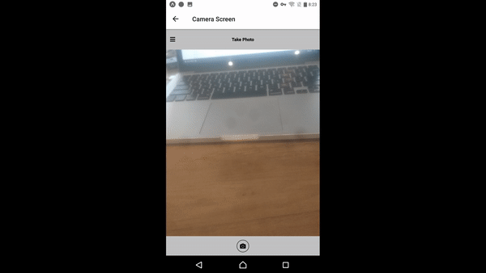
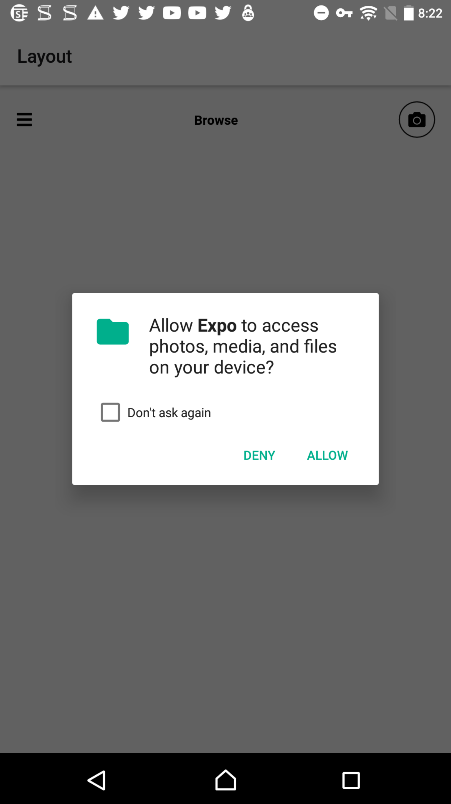
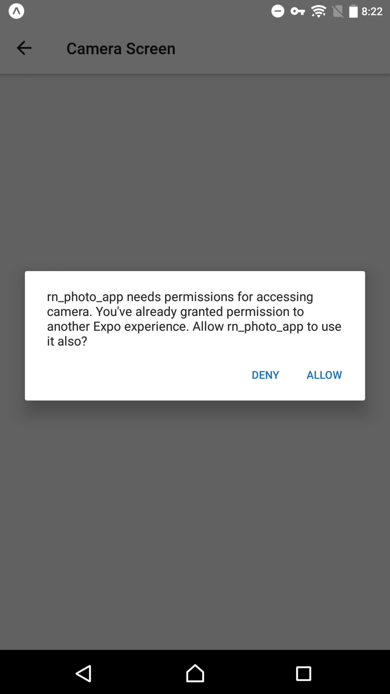
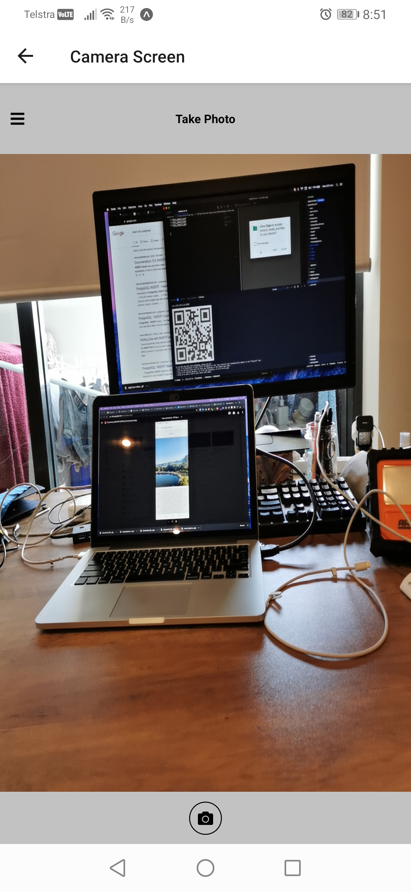
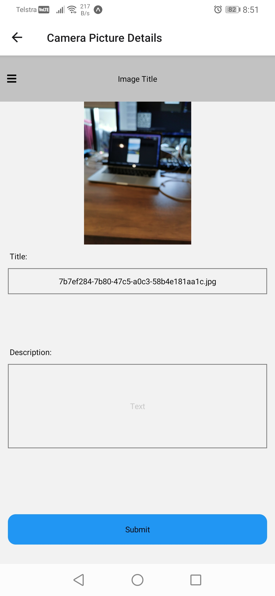
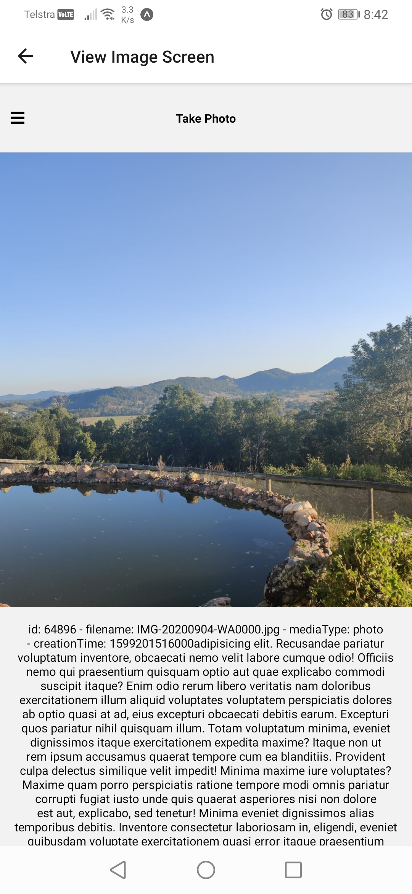

# React Native Photo Camera App

Tech Stack:

> React Native, expo

<video src='demo_images/test.mp4'></video>

https://github.com/DouggyC/rn_photo_camera_app/demo_images/test.mp4

https://user-images.githubusercontent.com/58986949/115314310-805b2780-a1a7-11eb-8558-648a367ea231.mp4

### Description

## Photo App for Android and iOS.

User can take and save photos to local device folder.
User can access local folder and view photo details.

Required Permissions:

- [x] Camera
- [x] Storage

## Expo Testable Link: https://expo.io/@avocadojs/rn_photo_app

### Expo App:

- Apple Store: https://apps.apple.com/app/apple-store/id982107779

- Play Store: https://play.google.com/store/apps/details?id=host.exp.exponent&referrer=www

  
  
  
  
  
  

## Future Features

- [ ] Infinite Scroll
- [ ] Write to specific dir
- [ ] Save to external database
